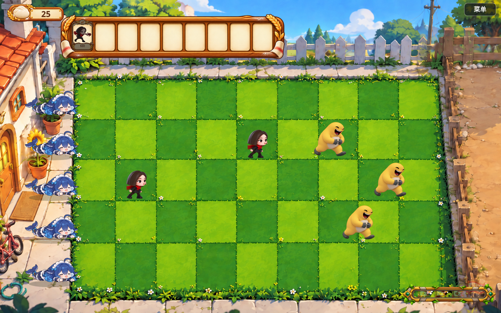

# 豆包大战奶蛙（doubao vs naiwa）

植物大战僵尸恶搞版网页小游戏。防守方「豆包家族」在自家草坪上抵御一波波「奶蛙」的进攻。
**非商用、纯整活开源项目，MIT 协议。**



## 玩法

- 打开页面先进入**开始菜单**：「开始游戏」进入**选关界面**（两关：第 1 关只有豆馅射手，第 2 关加入和面豆包，波次也不同）；「设置」查看操作说明；「退出」提示关闭标签页。
- 战场为 **5 行 × 8 列**草坪（格子大小不均，以背景图实测边界为准；`?debug` 可见网格线），分三块：左侧**家园区**（被突破且该行大肥鱼已用光即失败）、中间**作战区**、右侧**等待区**（奶蛙入场处）。
- 右上角「菜单」按钮：暂停本关、调音量、退出回选关；窗口失焦会自动暂停。
- 点击顶部卡牌选中防守单位，再点击作战区空格种下（消耗「面团」，初始 50；开局后每隔几秒会从右侧兽营**抛入一团面团**，落在作战区随机位置，点击拾取 +25，落地 12 秒不捡会消失；抛物线飞行途中也能接住）。
- **和面豆包**（≈向日葵）：周期性揉好一团面团抛在身旁，点击拾取 +25（点击后面团会先飞向左上角计数框再入账）。
- 右下角**进度条**实时显示波次推进；每波开始时对应旗帜升起，最后一波是大王旗。
- 每行院子边上趴着一条**大肥鱼**（≈小推车）：奶蛙突破家园界线时会被它冲锋吞掉整行——一次性保险，用掉后该行再被突破即失败。
- 第一只奶蛙会在**第二团面团落地后 5 秒**登场，之后按波次进攻。
- **豆馅射手**（≈豌豆射手）：向同行最靠前的奶蛙吐豆馅弹。
- **大笑奶蛙**（≈普通僵尸）：边走边笑，遇到防守单位停下啃咬。
- 守住全部波次即胜利；任意奶蛙越过家园区界线即失败。

## 开发

包管理器用 **pnpm**。

```bash
pnpm install        # 安装依赖
pnpm assets:slice   # 从 assets/ 原始设计稿切出序列帧（生成 public/assets/sprites/）
pnpm assets:bg      # 处理战场背景（生成 public/assets/bg/）
pnpm assets:home    # 处理开始菜单素材（生成 public/assets/home/）
pnpm assets:others  # 处理面团/大肥鱼单图素材（生成 public/assets/others|mower/）
pnpm dev            # 开发服务器
pnpm build          # 类型检查 + 构建到 dist/
```

调试模式：`http://localhost:5173/?debug` 会叠加网格线、行锚点、出生点与碰撞盒。

## 目录结构

```
assets/                 原始素材（设计稿 sprite sheet、战场背景，勿直接引用）
public/assets/          游戏运行时素材（bg + 切好的序列帧，由 assets:slice 生成）
scripts/
  slice-sprites.mjs     素材切片管线（裁剪矩形 + 边缘 flood-fill 抠图 + trim + 统一比例缩放）
  prepare-bg.mjs        处理战场背景到 public/assets/bg/（pnpm assets:bg）
  prepare-home.mjs      处理开始菜单素材到 public/assets/home/（pnpm assets:home）
  overlay-grid.mjs      网格校准叠加核对工具
  measure-grid.mjs      战场网格像素校准工具
  annotate-grid.mjs     网格校准结果可视化核对工具
src/
  core/                 assets（素材加载）、anim（序列帧播放器）、sfx（程序化音效+音量）
  game/
    config.ts           所有可调数值：网格、资源（面团）、小推车、关卡与波次
    units.ts            单位注册表（新增单位在这里加定义）
    grid.ts             格子换算
    entities.ts         单位/弹丸/面团/小推车实体
    systems.ts          面团抛入/拾取、波次、索敌射击、生产、啃咬、小推车、命中、清理
    ui.ts               卡牌栏、HUD（面团图标）、进度条与波次旗帜、暂停面板、胜负遮罩
    menu.ts             开始菜单（标题、开始/设置/退出按钮、说明面板）
    levelselect.ts      选关界面
    game.ts             主类：输入（含捡面团、菜单/暂停）、更新、绘制
```

## 如何新增一个单位

1. 把新角色的设计稿 sprite sheet 放进 `assets/doubao/` 或 `assets/naiwa/`。
2. 在 `scripts/slice-sprites.mjs` 的校准常量里加一段（裁剪矩形 + 帧数），跑 `pnpm assets:slice`。
3. 在 `src/game/units.ts` 的 `DEFENDERS` / `ATTACKERS` 里加一条定义（id 与切片输出目录同名）。
4. 防守单位会自动出现在卡牌栏；进攻单位在 `config.ts` 的波次表里引用即可。

## 素材说明

`assets/` 内的角色与场景图为 AI 生成的整活素材，仅供学习娱乐，请勿商用。

## License

MIT © doubao_vs_naiwa contributors
