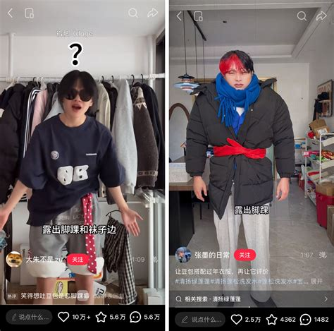
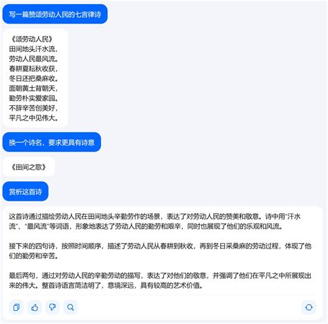

# 《豆包大战奶蛙》创意头脑风暴与梗图全景图鉴

本策划案严格遵循两大设计准则：
1. **脱离公司/职场视角**：完全聚焦于**普通网民日常调教、使用豆包 AI 的真实聊天记录、爆笑翻车与情绪价值名场面**。
2. **拒绝生硬的锁钥克制（反“仙人掌与气球僵尸”设计）**：防守方拥有独立的通用战术价值与阵容协同性；进攻怪具有鲜明的表情包演艺行为，但玩家可通过多种手段（爆发秒杀、减速拉扯、肉盾承伤、聚怪轰炸）自由应对。

---

## 模块一：奶蛙表情包怪物图鉴与读图拆解

奶蛙源于网友在 AI 绘图应用中生成“奶龙”时的模型异化与变异，随后在抽象二创、B站鬼畜与社交表情包中爆火。

### 1. 【笑翻倒地奶蛙】（源自：捧腹大笑抽搐表情包）


* **表情包读图**：黄色圆滚滚头身一体，黑洞洞的大眼睛笑成细缝，两只小灰爪拼命捂住肥硕的大肚腩；全身像过电般高频颤抖，笑到最后直接重心不稳**“啪叽”仰面后翻倒在地上，两脚朝天乱蹬**。
* **基础属性**：生命值 280 | 行进速度 26 px/s | 啃咬伤害 35
* **行为演出机制**：
  * **抽搐步态**：行进时全身剧烈抖动，自带魔性晃动感，正面受到的直射伤害降低 15%（单纯体现其皮实厚重）；
  * **笑翻倒地（阵型阻滞）**：当生命值被削减至 50% 以下时，奶蛙笑得脱力，仰面翻倒在地上 2.5 秒无法动弹。此时它并不是无敌的，但其肥硕的肚皮会**绊住其身后紧跟的奶蛙同伴**，造成短暂的小幅扎堆聚集。
* **玩家多维解法（无需特定卡牌）**：
  * **解法 A（范围轰炸）**：趁着后方同伴被它绊倒扎堆时，扔一个【扎心豆包】或用【开门见山豆包】一网打尽；
  * **解法 B（直线穿透）**：【一针见血豆包】可以直接连倒地奶蛙与其身后的扎堆怪一串全打穿；
  * **解法 C（前排点杀）**：用高频射手在它躺平爬起来的硬直期直接集火秒杀。

---

### 2. 【不知火舞·辣虾奶蛙】（源自：嘎嘎滴辣虾鬼畜表情包）


* **表情包读图**：头上扎着红发带，双手摇晃着小折扇，走两步就摆出一个极度妖娆的扭腰转体，嘴里疯狂吐出空耳鬼畜高音*“嘎嘎滴辣虾！”*。
* **基础属性**：生命值 200 (脆皮) | 行进速度 38 px/s (高机动) | 啃咬伤害 30
* **行为演出机制**：
  * **折扇热浪**：每行进 3 格原地挥扇一次，扇出一道粉色风刃，吹散正面直射而来的轻型弹丸（使直线豆馅伤害降低 30%）；
  * **挥扇滑步**：挥扇后它会借力向前快速滑行 1 格，迅速拉近与防线的距离。
* **玩家多维解法（无需特定卡牌）**：
  * **解法 A（近战贴脸拦截）**：前排用【糖包】或【开门见山豆包】直接堵住它，贴脸后它无法再滑步；
  * **解法 B（大范围水雾/泼洒）**：【摸鱼豆包】的三行水花或范围爆炸无法被折扇吹散，反而能将其淋湿减速；
  * **解法 C（侧翼交叉射击）**：【已读乱回豆包】从上下相邻行斜向射击，风刃无法阻挡侧翼子弹。

---

### 3. 【《创世纪》名画奶蛙】（源自：西斯廷天顶画表情包）


* **表情包读图**：黄色大肚腩侧卧在一片巴洛克风格的白色云朵上，神态慵懒空洞，一只短胖的食指慢悠悠地朝前伸出，还原名画《创造亚当》的神圣接触。
* **基础属性**：生命值 350 | 行进速度 18 px/s (漂浮) | 魔法伤害 25/s
* **行为演出机制**：
  * **低空漂浮**：悬浮在离地半尺的空中飘行，免疫地面的减速地毯或陷阱；
  * **“神圣一触”（长臂攻击）**：它不用嘴啃咬，而是在离防守植物还有 0.5 格时伸出食指指尖相对，持续造成魔法共鸣伤害（攻击距离比普通啃咬略远）。
* **玩家多维解法（无需特定卡牌）**：
  * **解法 A（击退打断）**：【不绕弯豆包】或【开门见山豆包】的木门沉重拍击，可将其连云带人向后推远，打断神圣触碰；
  * **解法 B（后排远程集火）**：由于其移动缓慢且攻击前摇长，双列普通射手即可在它进门前将其射落；
  * **解法 C（治疗对耗）**：配合【夸夸豆包】持续给被触碰的前排植物治疗套盾，轻松硬抗。

---

### 4. 【立牌硬纸板奶蛙】（源自：大学走廊自习室瓦楞纸立牌）


* **表情包读图**：完全是一张由瓦楞纸裁切打印出来的 1:1 等身硬纸板奶蛙，眼神呆滞，直挺挺地一蹦一蹦向前挪动。
* **基础属性**：生命值 160 (脆皮) | 行进速度 44 px/s (快速) | 撞击伤害 40
* **行为演出机制**：
  * **脆皮高速冲锋**：身板极脆，但移动速度较快；
  * **倒地变路障**：被打死后不会瞬间消失，而是“啪嗒”一声如硬纸箱般平拍在地面格子上，形成一个拥有 200 生命值的废弃纸盒障碍，暂时挡住该格子（使玩家短时间内无法在该格种植新豆包，6 秒后风化消失）。
* **玩家多维解法（无需特定卡牌）**：
  * **解法 A（前线远距离击杀）**：在草坪最右侧边缘就用射手将其击毙，让纸箱倒在敌方阵地，不影响自家后排布阵；
  * **解法 B（重击清障）**：【开门见山豆包】的重砸带有碾压判定，可以直接将怪与地上的纸盒一并砸得稀碎；
  * **解法 C（推土机清理）**：【不绕弯豆包】可以直接把倒地的纸箱推向右侧边线。

---

## 模块二：豆包防守 Card 设计与网络名场面

完全取材于普通用户在互联网上玩豆包 AI 的真实聊天记录与名场面：

### 1. 【夸夸豆包】（情绪价值 master）



* **网梗来源**：当代年轻人把豆包当成赛博闺蜜、深夜夸夸群主，无论发什么破防吐槽，豆包永远真诚地夸奖：“*你已经做得超棒啦，允许一切发生~*”。
* **定位**：**全能增益与战线续航辅助**（类似坚果急救包 / 治愈辅助）
* **基础属性**：消耗 75 面团 | 冷却 10 秒 | 生命值 300
* **泛用技能**：
  * **赛博拥抱（治疗）**：每隔 6 秒，对周围 3×3 范围内受伤最重的友方豆包送上真诚鼓励，持续恢复 120 点血量并附带一层短暂的小减伤气泡。
  * **情绪柔化（范围减攻）**：靠近夸夸豆包前两格的所有敌人，会因为受到极度温柔的赞美而降低狂暴程度，**对全场豆包的啃咬伤害降低 25%**。
* **阵容协同**：
  * 放在前排【糖包】身后，构成超强续航肉盾防线；
  * 保护后排昂贵的核心高费射手，防止被刺客突脸暴毙。
* **卡片台词**：*“宝，你今天也很棒！你值得草坪上所有的面团！”*

---

### 2. 【搜题豆包】（写题过程全对，答案写略）


* **网梗来源**：小孩哥拿豆包拍数学大题，豆包列了密密麻麻十二行高等微积分推导，在最底下潇洒写下一句大大的：*“由上可知，本题略”*。
* **定位**：**长线贯穿重炮 + 终末物理压制**（直线贯穿打击）
* **基础属性**：消耗 175 面团 | 冷却 14 秒 | 生命值 320
* **泛用技能**：
  * **超长卷轴推导**：每次攻击并不射击单颗子弹，而是向前铺出一张长长的、写满密密麻麻公式的“解题草稿纸卷轴”，卷轴向前滚动推进，对同行所有触碰的怪物造成持续切割伤害（60 穿透伤）；
  * **“本题略！”（终点震退）**：当草稿纸推到屏幕最右端或撞到坚硬障碍时，一个红色的巨大**“略”**字像印章一样狠狠盖下，产生小范围震荡，将周围所有怪向后震退半格。
* **阵容协同**：
  * 适合处理成群结队的密集小怪；
  * 与减速单位（如摸鱼豆包）配合，能让怪物在草稿纸滚动路径上吃满多次切割伤害。
* **卡片台词**：*“设未知数为 X，由题意同理可证……算了，本题略！”*

---

### 3. 【土味情话豆包】（油腻红毯）


* **网梗来源**：网友让豆包帮写表白情书，产出一堆令人脚趾扣地的油腻土味情话（*“宝，我今天去输液了，输的想你的夜”*）。
* **定位**：**地面地形改造 / 打滑失衡控制**（类似地刺/冰道）
* **基础属性**：消耗 100 面团 | 冷却 12 秒 | 生命值 300
* **泛用技能**：
  * **铺设油腻地毯**：向正前方地面喷洒飘散着玫瑰花瓣与肉麻文字的“粉色油腻地毯”，覆盖前方 3 格；
  * **脚滑踉跄**：踏上红毯的敌人由于地面极度油腻，**移动速度降低 35%**，且攻击时有 30% 几率脚滑失衡、空刀一次。地毯持续 15 秒后挥发。
* **阵容协同**：
  * 地面铺毯不占植物格子，配合任何远程射手（豆馅射手、一针见血）都能极大延长敌人的受击时间；
  * 配合击退单位，能让被推开的怪在红毯上反复打滑。
* **卡片台词**：*“宝，你在我脑子里跑了一整天了，脚不酸吗？”*

---

### 4. 【打断豆包】（随时插话）



* **网梗来源**：豆包语音通话最核心的“随时插话打断”功能与甜美桃子音。
* **定位**：**高频单点压制 / 微眩晕硬直打断**（机枪射手与微击晕融合）
* **基础属性**：消耗 125 面团 | 冷却 7.5 秒 | 生命值 320
* **泛用技能**：
  * **高频连珠音波**：以极高频率射出粉色声波弹丸（攻速是普通豆包的 2 倍，单发 12 伤害）；
  * **“插句话！”（打断硬直）**：每射击第 5 发子弹，必定伴随一声清脆的*“打断一下！”*，使被命中的目标产生 0.6 秒短暂硬直（任何怪物处于啃咬、抬手、行走都会被强行卡顿一下）。
* **阵容协同**：
  * 单点压制高速脆皮冲锋怪（如奶鸡）；
  * 对付大体型单位，高频的微硬直能有效延缓其前进与啃咬频率，给全线争取布防时间。
* **卡片台词**：*“打断一下！我刚刚是想说——你先等会儿！”*

---

## 模块三：代码架构对接建议（`src/game/units.ts`）

新增单位与现有架构完全契合，仅需在现有的配置对象上拓展少量字段：

```typescript
// 1. 夸夸豆包 (治愈与范围弱化)
{
  kind: 'defender',
  id: 'kuakua_doubao',
  name: '夸夸豆包',
  effect: '回血并降怪攻',
  cost: 75,
  cooldown: 10,
  hp: 300,
  damage: 0,
  healer: { interval: 6, amount: 120, range: 1.5 },
  softenAura: { range: 160, weakenDamageFactor: 0.75 },
  spriteH: 102,
  flipX: false,
  describe: '“宝你今天也超棒！”每隔6秒为周围残血队友疗伤，并使身边奶蛙的啃咬攻击力降低25%。'
}

// 2. 搜题豆包 (长线草稿纸卷轴与震退)
{
  kind: 'defender',
  id: 'souti_doubao',
  name: '搜题豆包',
  effect: '穿透卷轴震退',
  cost: 175,
  cooldown: 14,
  hp: 320,
  damage: 60,
  scrollPierce: { speed: 380, endKnockback: 40 },
  spriteH: 105,
  flipX: false,
  describe: '“由题意可知本题略！”铺出长条微积分草稿纸卷轴穿透整行，终点重重盖下大字“略”并震退敌人。'
}

// 3. 笑翻倒地奶蛙 (抖动减伤与半血绊倒)
{
  kind: 'attacker',
  id: 'trip_laugh_frog',
  name: '笑翻奶蛙',
  hp: 280,
  speed: 26,
  biteDamage: 35,
  biteInterval: 1.0,
  biteReach: 52,
  damageReduction: 0.15,
  fallOverOnHpRatio: 0.5,
  fallDuration: 2.5,
  spriteH: 110,
  flipX: true,
  flipDeath: false,
  damageStages: [0.66, 0.33]
}
```

本案既做到了**真梗纯正、表情包画面实景还原**，又保证了塔防游戏所必需的**多维博弈与阵容自由度**！
